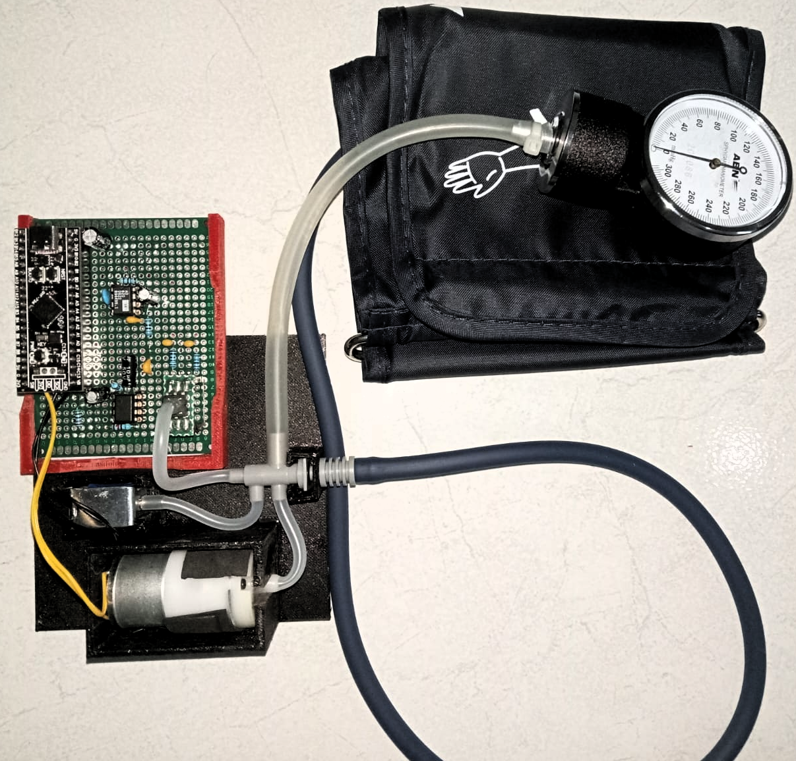
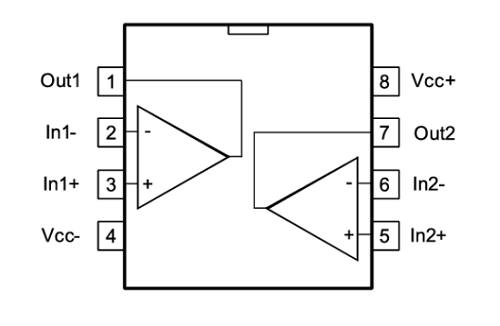

  

<h4 align="center">This project is funded by IFAC Activity Fund (July 2025 to June 2026)</h4>

__CuffnCode__ is a retrofitted blood pressure measurement system for teaching and research. In the long term, it aims to become an overinstrumented platform for developing and testing signal processing and control algorithms.

## Retrofitted pump system

 

## Analog Front End Design
A reproducible, low-noise analog front end for millivolt bridge sensors (e.g., MPS20N0040D, typically used for __hobbyist__ sphygmomanometer), using AD620 instrumentation amplifier and TLC2272 level shift. This analog front end should also work for other millivolt instruments.

### TINA-TI

DC simulation with TINA-TI:

 

Instrumentation amplifier gain:

$$ G = 1 + \frac{49.4\text{k}\Omega}{R_g} $$

LM358 offset:

$$ \frac{56 \text{k}}{47\text{k} + 56 \text{k}} \times 3.3 V \approx 1.5 V$$

### MPS20N0040D
The MPS20N0040D is a millivolt-level bridge (≈50–100 mV full-scale; 4–6 kΩ)

|  |  |
| ----------------------------------------- | ----------------------------------------- |

### TLC2272 (Dual, Low-Noise, Rail-To-Rail Operational Amplifier)
This will be used to offset the instrumentation amplifier, giving headroom for possible undershoot or for signal that goes both ways (positive and negative).

 

### AD620
This is the instrumentation amplifier that is relatively cheap and widely available in Indonesian market.

|  |  |
| ----------------------------------------- | ----------------------------------------- |

## Digital Controller
We will use STM32F411CE (the black pill) as our digital processor.

|  |  |
| ----------------------------------------- | ----------------------------------------- |

## Safety & Notes

- The MPS20N0040D is fragile—avoid over-pressure.
- If powering from USB, beware ground noise from the host PC. A ferrite on the USB cable can help.

## Next-to-Do
- 50/60 Hz notch filter (hum killer).
- PCB layouting.
- Performance evaluations.

## Credits

- Instrumentation amplifier intro: https://www.youtube.com/watch?v=O0-iczIq1aU
- INA333 review with AD620 suggestion: https://blog.robertelder.org/cjmcu-333-ina-333-instrumentation-amplifier/
- A Designer’s Guide to Instrumentation Amplifiers (3rd Edition) https://www.analog.com/media/en/training-seminars/design-handbooks/designers-guide-instrument-amps-complete.pdf

